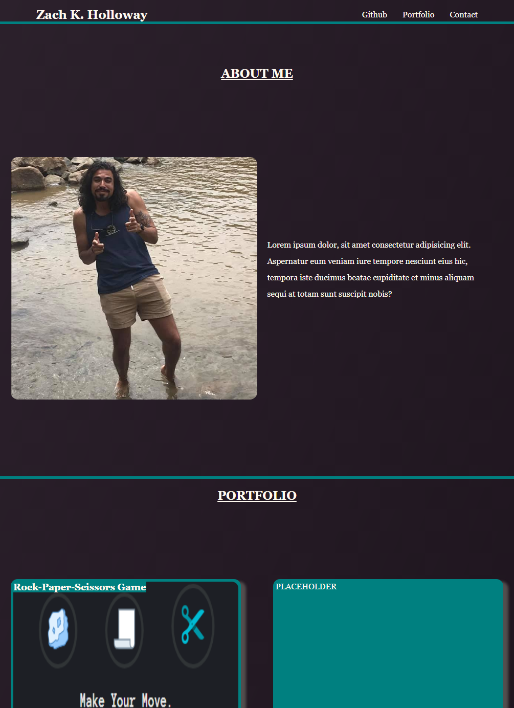

# portfolioProject

This is meant to be a responsive portfolio to show potential employers a users web-application portfolio and profile. It is broken up into a profile section, portfolio section, and contact section. For place holder info I used my personal contact. Functioning example image can be found in the link below.

